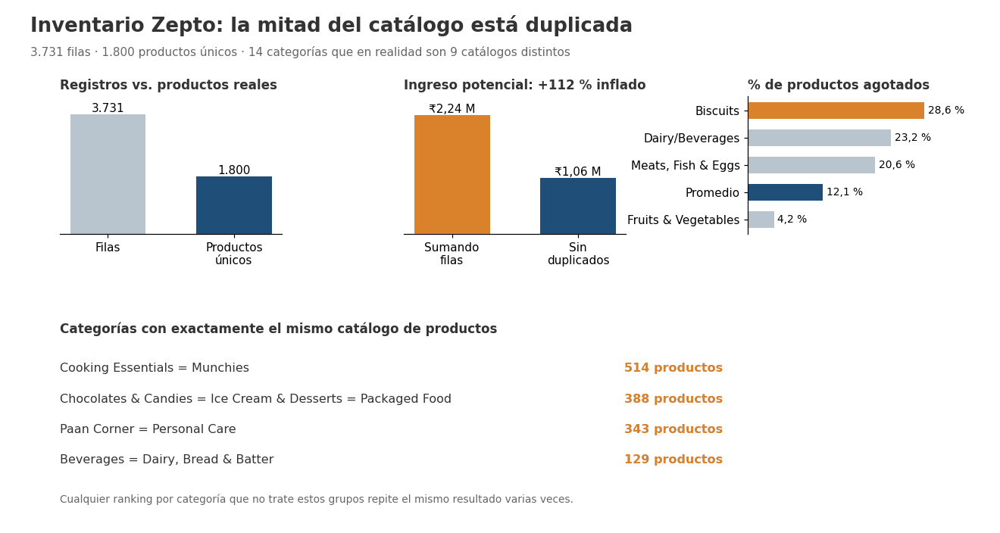

# Inventario de Zepto con SQL: la mitad del catálogo está duplicada

**PostgreSQL · SQL (CTEs, funciones de ventana, validación de calidad de datos)**

## Resumen ejecutivo

**Problema:** un equipo de e-commerce quiere decidir precios, reabastecimiento y surtido a partir del catálogo de Zepto, una plataforma de *quick-commerce* de la India.

**Hallazgo principal:** las 3.731 filas del catálogo corresponden a solo **1.800 productos únicos**. El 71 % de los productos aparece en 2 a 7 categorías y **4 grupos de categorías tienen exactamente el mismo catálogo**. Sumar por fila **infla el ingreso potencial un 112 %** (₹2,24 M en lugar de ₹1,06 M).

**Recomendación:** corregir la taxonomía de categorías en la fuente antes de reportar por categoría, y priorizar el reabastecimiento de **Biscuits**, con 28,6 % de productos agotados frente al 12,1 % del promedio.



## Contexto

El proyecto parte del dataset y las 8 preguntas de negocio de un proyecto guiado muy difundido ([Amlan Mohanty](https://github.com/amlanmohanty1/zepto-SQL-data-analysis-project)). Al reproducirlo, los resultados por categoría mostraron valores idénticos entre categorías distintas, así que antes de responder las preguntas se investigó la calidad del dato.

**Aportes propios frente al proyecto original:**
- Diagnóstico de duplicados y detección de categorías con catálogos idénticos (sección 3 del script).
- Tabla de productos únicos y vista de asignación proporcional por categoría, para no contar dos veces el mismo inventario.
- Las 8 preguntas recalculadas sobre productos únicos, sin `DISTINCT` para ocultar duplicados.
- Cuatro consultas avanzadas con CTEs y funciones de ventana (`RANK`, `NTILE`, `SUM() OVER()`).
- Validación de consistencia entre precio, descuento y precio final.

## Datos

| Aspecto | Detalle |
|---|---|
| Fuente | `data/zepto_v2.csv`, catálogo de Zepto publicado en Kaggle (obtenido por *scraping* de la web de Zepto, según el proyecto original) |
| Tamaño | 3.732 filas × 9 columnas, 14 categorías |
| Granularidad real | Una fila por producto **y categoría** (no por producto) |
| Precios | En *paise* (1 rupia = 100 paise); se convierten a rupias |
| Calidad | 0 nulos · 1 registro con precio 0 (eliminado) · 1.931 filas duplicadas entre categorías · 10,4 % de productos con precio final inconsistente |

## Enfoque

1. **Exploración:** conteos, nulos, categorías.
2. **Diagnóstico de duplicados:** filas frente a productos únicos, presencia de cada producto por categoría y detección de categorías idénticas mediante una firma (hash) de su lista de productos.
3. **Limpieza:** eliminación del precio 0, conversión a rupias, tabla `zepto_productos` (1 fila por producto) y vista `zepto_por_categoria`, que asigna a cada aparición un peso de 1/n categorías.
4. **Preguntas de negocio P1–P8** sobre productos únicos.
5. **Consultas avanzadas A1–A4.**

## Hallazgos

1. **El catálogo real tiene 1.800 productos, no 3.731.** El 71,2 % de los productos aparece en más de una categoría (hasta en 7).
2. **14 categorías, pero solo 9 catálogos distintos.** Cooking Essentials = Munchies (514 productos); Chocolates & Candies = Ice Cream & Desserts = Packaged Food (388); Paan Corner = Personal Care (343); Beverages = Dairy, Bread & Batter (129). Cualquier ranking por categoría repite el mismo resultado para estas categorías.
3. **Ingreso potencial real: ₹1.058.454.** Sumar las filas del catálogo da ₹2.243.081, un 112 % más.
4. **El 12,1 % de los productos está agotado** (217 de 1.800). Biscuits, una categoría sin productos compartidos, llega al **28,6 %**, más del doble del promedio; Fruits & Vegetables está en 4,2 %.
5. **Los productos más caros tienen más descuento:** el quintil de precio más bajo (₹10–49) promedia 6,0 % de descuento y el más alto (₹225–2.600), **10,3 %**.
6. **Fruits & Vegetables tiene el mayor descuento promedio (15,5 %)**, seguida de Meats, Fish & Eggs (11,0 %). Fruits & Vegetables solo comparte 4 de sus 93 productos con otras categorías, así que su resultado sí es confiable.
7. **El 10,4 % de los productos (187)** tiene un precio final que no coincide con MRP × (1 − % descuento) por más de ₹1. Lo más probable es que el porcentaje de descuento venga redondeado, así que conviene usarlo como dato aproximado.

## Recomendaciones

| Recomendación | Basada en | Prioridad |
|---|---|---|
| Corregir la asignación de categorías en la fuente y reportar por categoría solo después | Hallazgos 1 y 2 | Alta |
| Calcular inventario e ingreso sobre productos únicos, nunca sumando filas del catálogo | Hallazgo 3 | Alta |
| Priorizar el reabastecimiento de Biscuits y revisar su proceso de pedidos | Hallazgo 4 | Alta |
| Revisar el margen en productos de precio alto, que concentran los descuentos mayores | Hallazgo 5 | Media |
| Calcular el descuento a partir de MRP y precio final, en lugar de usar el porcentaje reportado | Hallazgo 7 | Baja |

## Consultas avanzadas

| # | Pregunta | Técnica |
|---|---|---|
| A1 | Top 3 productos por ingreso potencial en cada categoría | CTE + `RANK() OVER (PARTITION BY …)` |
| A2 | Tasa de agotados por categoría y su posición | CTE + asignación proporcional + `RANK()` |
| A3 | ¿Los productos caros tienen más descuento? | `NTILE(5)` por precio |
| A4 | Precios finales inconsistentes | Regla de validación |
| P3b | Participación de cada categoría en el ingreso | `SUM() OVER ()` |
| 3.4 | Categorías con catálogo idéntico | `STRING_AGG … ORDER BY` + `MD5` |

## Limitaciones

- El "ingreso potencial" es precio con descuento × stock disponible: es un indicador de inventario valorizado, no de ventas.
- La asignación proporcional reparte un producto en partes iguales entre sus categorías. Es una convención para no duplicar el total, no la categoría "real" del producto, que el dataset no permite conocer.
- Un producto se considera único por la combinación de nombre, precios, descuento, peso, stock y presentación. Dos presentaciones distintas del mismo producto cuentan como productos diferentes.
- Es un catálogo en un solo momento: no permite medir tendencias ni rotación.

## Estructura del repositorio

```
zepto-sql-analysis/
├── data/zepto_v2.csv
├── sql/zepto_analysis.sql      # carga, diagnóstico, limpieza, P1–P8 y A1–A4
├── images/hallazgos.png
└── README.md
```

## Cómo reproducir

1. Clona el repositorio:
   ```bash
   git clone https://github.com/montoyajaum-debug/zepto-sql-analysis.git
   cd zepto-sql-analysis
   ```
2. Ejecuta el script con `psql` desde la raíz del repo. Crea las tablas, carga el CSV y corre todas las consultas:
   ```bash
   psql -U postgres -d tu_base -f sql/zepto_analysis.sql
   ```
   En **pgAdmin**: ejecuta el bloque 0, importa el CSV con *Import/Export Data* (CSV, Header = Yes, UTF8, sin la columna `sku_id`) y luego el resto del script.

## Autor

**Jhon Alexander Urrea Montoya** · [LinkedIn](https://www.linkedin.com/in/jhon-urrea-data) · [GitHub](https://github.com/montoyajaum-debug)
